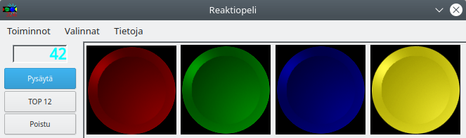

Reaction game
=============

Simple reaction game with four different color buttons which blink in
random order and you should push them in the same order to score.
Requires `Lazarus IDE <https://www.lazarus-ide.org/>`_ to compile the
Pascal source code to executable program.

History
-------

This is an old school project written in 2001 for Delphi/Pascal
environment.  As a 20 year anniversary, in 2021, the project was
converted to be compatible with the Lazarus environment so that it can
be ran on multiple platforms.  The new version has been tested to work
on Linux at least.

License
-------

Every file in this repository is licensed with the MIT license.  See the
LICENSE file for the license text.
